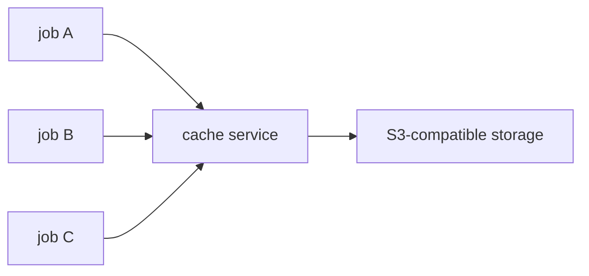
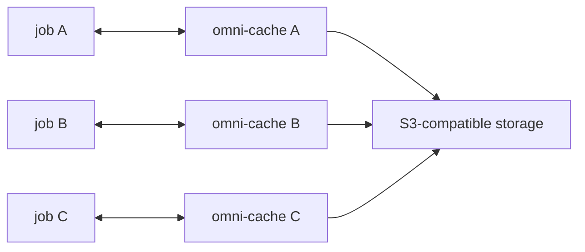

# Omni Cache Sidecar

Omni Cache is a sidecar daemon that exposes multiple cache protocols on a local endpoint while
storing blobs in S3-compatible storage. Run it next to a CI runner or build job so cache traffic
goes directly to object storage instead of a centralized proxy that becomes a bottleneck at scale.

Omni Cache has powered billions of caching operations for [Cirrus Runners](https://cirrus-runners.app/)
and [Cirrus CI](https://cirrus-ci.org/) since 2017.

At a glance:
- CI-agnostic sidecar: run it alongside your job/runner, keep data on your network.
- S3-backed: works with AWS S3 or any S3-compatible storage.
- Multi-protocol: supports GitHub Actions cache v2 (used by Docker layer caching), Bazel, Gradle,
  Xcode/LLVM, and custom HTTP clients.

A traditional centralized cache service, as shown below, becomes a shared bottleneck as workloads scale because all jobs traverse one service and its links to S3:



Each job sends cache traffic through the centralized service, which can increase latency and amplify data-transfer costs
(especially egress/cross-AZ) unless it is scaled accordingly.

In a sidecar-per-job approach, each sidecar talks directly to S3, removing the centralized proxy from the hot path:



## Supported protocols & clients

Omni Cache is CI-agnostic: if your runner can reach the sidecar, it works. These are the built-in
protocols with ready-to-copy examples in `PROTOCOLS.md`:

| Use case / client    | Protocol                        | Example                                                  |
|----------------------|---------------------------------|----------------------------------------------------------|
| Docker Layer Caching | GitHub Actions cache v2 (`gha`) | `PROTOCOLS.md#docker-layer-caching-github-actions-cache` |
| Bazel                | HTTP cache                      | `PROTOCOLS.md#bazel-http-cache`                          |
| Gradle               | HTTP build cache                | `PROTOCOLS.md#gradle-http-build-cache`                   |
| CCache               | HTTP storage backend            | `PROTOCOLS.md#ccache-http-storage-backend`               |
| Xcode / LLVM         | HTTP cache                      | `PROTOCOLS.md#xcode--llvm-compilation-cache`             |
| Custom HTTP clients  | HTTP cache                      | `PROTOCOLS.md#custom-http-clients`                       |

## Installation

Special [Setup Action](https://github.com/cirruslabs/setup-omni-cache) for Github Actions:

```yaml
steps:
  - name: Setup omni-cache
    id: cache
    uses: cirruslabs/setup-omni-cache@main # or any pinned release
    with:
      bucket: ci-omni-cache
      s3-endpoint: ${{ secrets.S3_ENDPOINT }} # can be R2, for example
    env:
      AWS_ACCESS_KEY_ID: ${{ secrets.AWS_ACCESS_KEY_ID }}
      AWS_SECRET_ACCESS_KEY: ${{ secrets.AWS_SECRET_ACCESS_KEY }}
      AWS_REGION: us-east-1

  # Your build steps can now use the cache endpoint
  - name: Build with cache
    run: |
      # Configure your build tool to use the OMNI_CACHE_ADDRESS env var
      # which is automatically exposed by cirruslabs/setup-omni-cache
      bazel build //... --remote_cache=http://$OMNI_CACHE_ADDRESS
```

Alternative way to install in any other environment:
- [Homebrew](INSTALL.md#homebrew)
- [Debian-based distributions](INSTALL.md#debian-based-distributions) (Debian, Ubuntu, etc.)
- [RPM-based distributions](INSTALL.md#rpm-based-distributions) (Fedora, CentOS, etc.)
- [Prebuilt Binary](INSTALL.md#prebuilt-binary)
- [Golang](INSTALL.md#golang)

## Sidecar mode (defaults)

- Listens on a local TCP address (default `localhost:12321`) and, on Unix, a unix socket at
  `~/.cirruslabs/omni-cache.sock`.
- Serves HTTP and gRPC (h2c) on the same port.
- All built-in protocols are enabled by default.

Run against your S3 bucket:

```sh
export AWS_REGION=us-east-1
export AWS_ACCESS_KEY_ID=...
export AWS_SECRET_ACCESS_KEY=...
omni-cache sidecar --bucket ci-cache --prefix my-repo
```

Quick local test with LocalStack (requires Docker):

```sh
omni-cache dev
```

## Configuration

- `--bucket` (required): S3 bucket to store cache blobs.
- `--prefix` (optional): prefix for cache objects.
- `--s3-endpoint` (optional): override the S3 endpoint URL (must include scheme, e.g. `https://s3.example.com` or `http://localhost:4566`).
  When set, Omni Cache uses path-style S3 requests for compatibility with S3-compatible endpoints.
- `--listen-addr` (optional): listen address. Accepts `host`, `host:port`, or `http(s)://host:port`.
  Default: `localhost:12321`. This address is also embedded into GitHub Actions cache v2
  upload/download URLs, so set it to something your clients can reach.
- S3 credentials and region are resolved via the AWS SDK default chain (`AWS_REGION`,
  shared config/credentials files, instance roles). If no region is set, Omni Cache defaults to `us-east-1`.

Common examples:
- `omni-cache sidecar --bucket ... --prefix ... --s3-endpoint ... --listen-addr ...`
- `omni-cache dev --bucket ... --prefix ... --localstack-image ... --listen-addr ...`

## Dev mode (LocalStack)

Use this when you want to test your project against a local Omni Cache instance without provisioning
real S3. It starts a LocalStack S3 backend and the sidecar (Docker required):

```sh
omni-cache dev
```

Defaults: listens on `localhost:12321`, creates a LocalStack bucket named `omni-cache-dev`. Then point
your build tool to the sidecar using the protocol examples in `PROTOCOLS.md`.                     |

## Cache metrics endpoint

Omni Cache exposes a lightweight stats endpoint on the same host as the sidecar.

- `GET /metrics/cache` returns counters and transfer metrics.
- `DELETE /metrics/cache` resets the counters and returns the post-reset snapshot.
- Responses are `text/plain` by default. Send `Accept: application/json` (or `+json`) to get JSON.
- Send `Accept: text/vnd.github-actions` to emit GitHub Actions notices (empty response when no cache activity is recorded).
- This endpoint is especially useful as the final step of a CI pipeline to record cache effectiveness.

Text output example:

```
omni-cache stats
cache hits: 10472
cache misses: 117
cache hit rate: 98.9%
downloads: count=10472 total=1.9 GiB avg=194 KiB avgTime=7ms avgSpeed=28 MB/s
uploads: count=3810 total=131 MiB avg=35 KiB avgTime=361ms avgSpeed=100 kB/s
```

JSON fields:

- `cache_hits`, `cache_misses`, `cache_hit_rate_percent`
- `downloads` / `uploads`: `count`, `bytes`, `duration_ms`, `avg_bytes`, `avg_duration_ms`, `bytes_per_sec`

## Configuration gotchas

- `--listen-addr` must be reachable by your CI clients (not just `localhost` if the client runs in
  a different container or machine).
- Bucket names and prefixes are best kept lowercase to avoid S3 compatibility issues.
- When using a custom `--s3-endpoint`, ensure the scheme is included (https/http). Omni Cache will
  switch to path-style addressing for compatibility.

## Security & networking notes

- Omni Cache uses the AWS SDK credential chain (environment variables, shared config, instance
  roles). Avoid hardcoding credentials in CI logs.
- The sidecar is typically run on the same host as the build; if you need remote access or TLS
  termination, place it behind a trusted reverse proxy.

## Protocols

Omni Cache ships with built-in protocols enabled. See `PROTOCOLS.md` for build-system-focused examples.

Need a custom protocol? Check [existing issues](https://github.com/cirruslabs/omni-cache/issues?q=is%3Aissue%20state%3Aopen%20Support) or create a new one.

## Development

Run omni-cache with a LocalStack S3 backend (Docker required):

```sh
go run ./cmd/omni-cache dev
```
